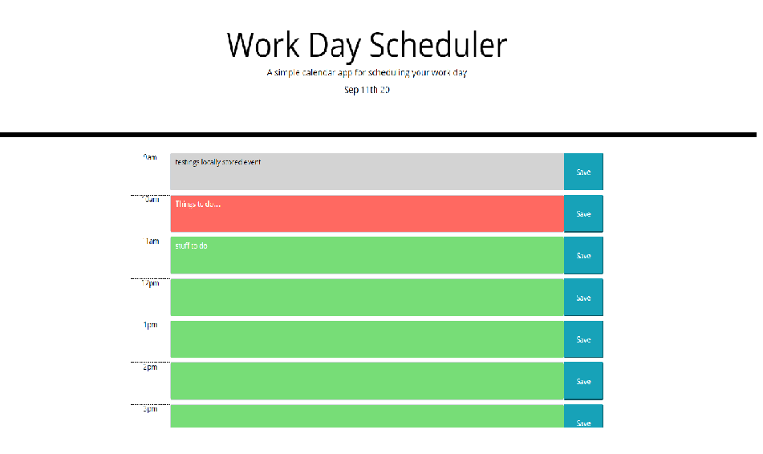

# Work_Day-Scheduler

For this task I was to create a simple calendar application that allows the user to save events for each hour of the day. This app will run in the browser and feature dynamically updated HTML and CSS powered by jQuery.

When loading the application, it would use real time throug the use of moment.js to show the current date at the top and have the time correctly correspond to the appropriate time slots on the page.

The User can then type in anyting in one of the time slots, hit the corresponding "Save button" and the input text in the text area would get stored into local storage, and saved to that text area, even when reloading the page (locally).

I then through the use of javascript and moment.js added attribute(class) to the textareas based on the current time to change the color of the area depending on if it is in the past, present or future.  

I made all of this functionable through the use of Javascript (and jQuery), to create the elements to load to the page, have them respong to click events and locally store and set data.

This was a fun challenge, as it was my first assignment basing functions and actions off of time.  

Here is a link to the page: https://rseckman.github.io/Work_Day-Scheduler/